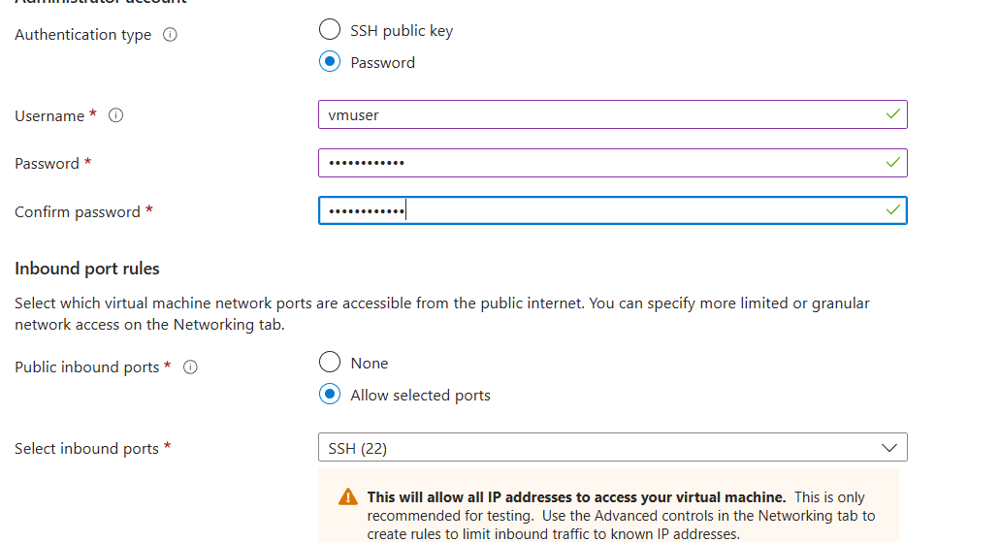
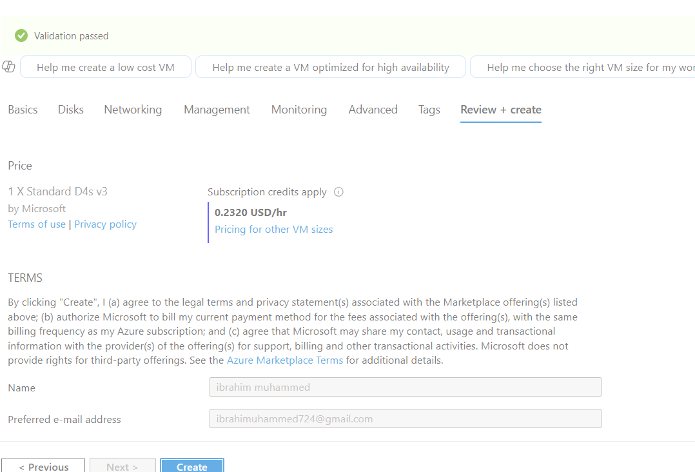
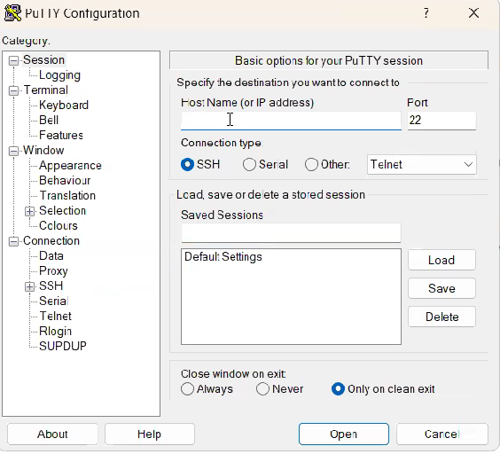
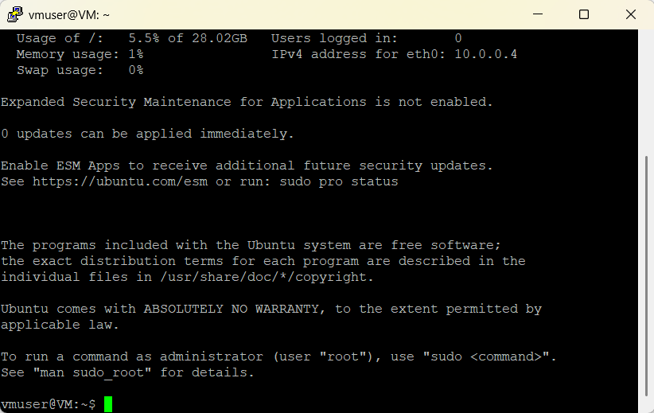
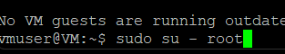
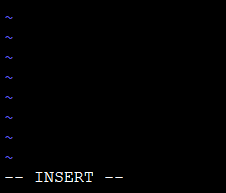
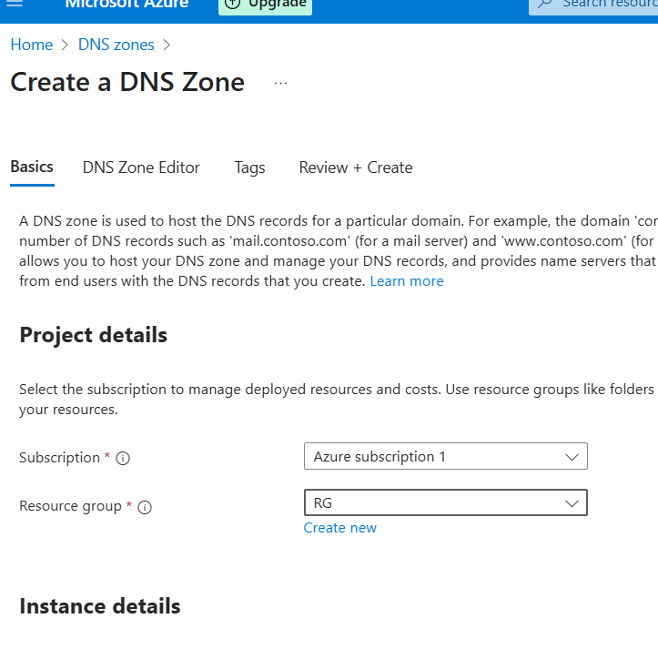
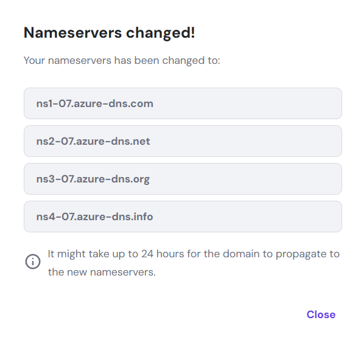
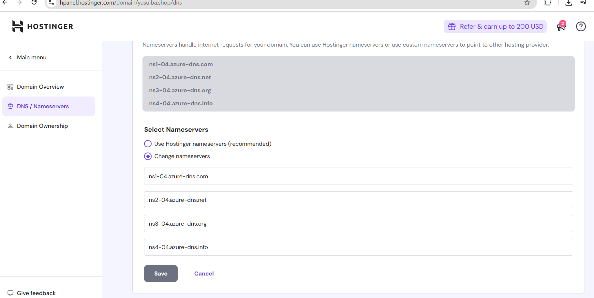

C#  Website Hosting on Azure Linux VM (Yusuiba Project)

This project demonstrates hosting a static website on an **Ubuntu Linux Virtual Machine** in Microsoft Azure and configuring a **custom domain (yusuiba.shop)** purchased from Hostinger.  

---

##  **1. Provisioned Azure Virtual Machine**

- Created a new **Resource Group (RG)**
- Deployed an **Ubuntu Server** VM in **UK South**
- VM Size: **16 GiB memory**
- Authentication:
  - **Username:** vmuser  
  - **Password-based login**
- Disabled **Boot Diagnostics**
- Successfully deployed the VM

---

##  **2. Connected to the Linux Server**

- Connected using **PuTTY** with VM’s **Public IP**
- Logged in with username & password  
- Updated server packages:

```bash
sudo apt update
sudo apt upgrade
```

---

##  **3. Installed & Configured Web Server**

- Installed Apache web server
- Opened the default HTML file:

```bash
vim /var/www/html/index.html
```

- Deleted default content  
- Pasted the HTML template downloaded from **tooplate.com**
- Saved changes using `:wq`
- Allowed HTTP traffic in **Azure Network Security Group** (Port 80)
- Verified website in browser using Public IP

---

##  **4. Purchased & Configured Custom Domain**

- Purchased domain: **yusuiba.shop** from Hostinger
- Created DNS Zone in Azure
- Added **A Record** pointing to VM Public IP
- Copied required **Name Server (NS)** values
- Updated nameservers inside Hostinger DNS panel
- Waited ~24 hours for DNS propagation
- Website successfully mapped:
- 
###  **https://www.yusuiba.shop**
Allowed 24 hrs for DNS propagation


##  **Project Screenshots **

-VM Provisioning







-SSH Connection to Linux Server






-Apache Installation & Website Setup





-DNS & Custom Domain Configuration









# **Skills Gained**

- Azure Virtual Machines (Linux)
- SSH using PuTTY
- Apache Web Server Hosting
- DNS Zone Management
- Custom Domain Mapping
- Azure Networking (NSG rules)
- Linux server configuration
- Website deployment on cloud

##  **Status**
Project Completed ✔
Website successfully mapped to custom domain:

www.yusuiba.shop


